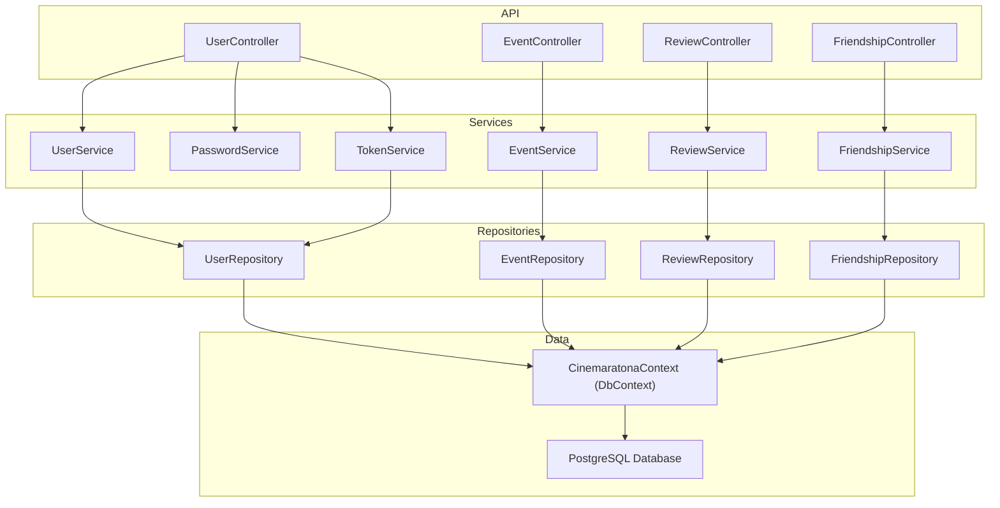

# Cinemaratona Backend

## Integrantes:

>[!NOTE]
> Nome: Kleber Daniel Mattos Viana. Matrícula: 06007199 Email: danielcmc100@gmail.com
>
> Nome: Bernard Abreu Machado. Matrícula: 06006244 Email: benydepaull@hotmail.com
>
> Nome:Hugo Norte . Matrícula: 06006259 Email: hugonorte@gmail.com
>
> Nome:Gabriel Maciel de Aguiar Silva . Matrícula: 06006665 Email: gabriielmaciel17@gmail.com
>
> Nome: Diego Eufrasio Martorana. Matrícula: 06006338 Email: diego18tere@gmail.com

## Entregáveis engenharia de software:
- [x]  Backlog completo (Coluna a fazer no Trello)
- [x]  Trello demonstrando as atividades realizadas no período
    https://trello.com/b/rrcDpbzz/cinemaratona
- [x]  Back end completo e disponível em conta pública do GitHub
    https://github.com/Danielcmc100/cinemaratona-backend
- [x]  Coleção Postman (ou insomnia ou outro produto similar) para testar todos os endpoints
    Arquivo Insomnia.yaml no repositório
- [x]  Diagrama de componentes do produto
    mermaid no readme
- [x]  Vídeo explicando o sistema
    https://youtu.be/VThpAyh2SsA

## Visão Geral

Este projeto é o backend para a aplicação Cinemaratona. Ele fornece APIs e serviços para gerenciar e interagir com a plataforma Cinemaratona.

## Pré-requisitos

- [.NET 9.0 SDK](https://dotnet.microsoft.com/download/dotnet/9.0)
- [Docker](https://www.docker.com/get-started)
- [Docker Compose](https://docs.docker.com/compose/install/)

## Variáveis de Ambiente

- `Jwt:Key`: Chave secreta para geração de tokens JWT (obrigatória).
- `ConnectionStrings__DefaultConnection`: String de conexão com o banco de dados (opcional, padrão já definido para desenvolvimento).

## Instalação e Execução (Desenvolvimento)

1. Clone o repositório:
    ```sh
    git clone https://github.com/yourusername/cinemaratona-backend.git
    cd cinemaratona-backend
    ```

2. Restaure as dependências:
    ```sh
    dotnet restore
    ```

3. Suba o banco de dados:
    ```sh
    docker-compose up -d postgres
    ```

4. Aplique as migrações do banco de dados:
    ```sh
    dotnet ef database update
    ```

5. Adicione uma chave para JWT (apenas desenvolvimento):
    ```sh
    dotnet user-secrets set "Jwt:Key" "this-is-a-super-secret-key-32-bytes"
    ```

6. Inicie a aplicação:
    ```sh
    dotnet run --project Cinemaratona
    ```

A aplicação estará disponível em `http://localhost:5199`.

Você pode acessar a documentação da API em `http://localhost:5199/swagger` ou importar o arquivo [Insomnia.yaml](Insomnia.yaml) no Insomnia.

## Execução com Docker Compose (Produção)

1. Defina a chave JWT como variável de ambiente:
    ```sh
    export Jwt__Key="this-is-a-super-secret-key-32-bytes!!"
    ```

2. Construa e inicie os containers:
    ```sh
    docker-compose up --build
    ```

A aplicação estará disponível em `http://localhost:5199`.

## Executando Testes

1. Restaure as dependências:
    ```sh
    dotnet restore
    ```

2. Execute os testes:
    ```sh
    dotnet test TestCinemaratona
    ```

## Construindo o Projeto

Para construir o projeto, use o seguinte comando:
```sh
dotnet build Cinemaratona
```

## Estrutura do Banco de Dados

O esquema do banco de dados está definido no arquivo `DatabaseSchema.dbml`. Ele contém as seguintes tabelas:

- `users`: Armazena informações dos usuários.
- `friendships`: Gerencia as relações de amizade entre os usuários.
- `reviews`: Armazena as avaliações dos filmes feitas pelos usuários.
- `events`: Gerencia os eventos criados pelos usuários.

## Configuração do Insomnia

Para facilitar o desenvolvimento e teste das APIs, um arquivo de configuração do Insomnia (`Insomnia.yaml`) está incluído no projeto. 

Para usar o arquivo de configuração, importe-o no Insomnia e ajuste as variáveis de ambiente conforme necessário.

## Contribuindo

Se você deseja contribuir para este projeto, siga estes passos:

1. Faça um fork do repositório.
2. Crie um novo branch (`git checkout -b feature-branch`).
3. Faça suas alterações.
4. Comite suas alterações (`git commit -m 'Adicione alguma funcionalidade'`).
5. Faça o push para o branch (`git push origin feature-branch`).
6. Abra um pull request.

## Contato

Se você tiver alguma dúvida ou sugestão, sinta-se à vontade para abrir uma issue ou entrar em contato com os mantenedores do projeto.

# Diagrama de componentes / arquitetura


